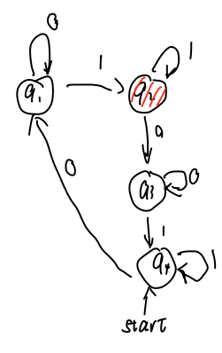
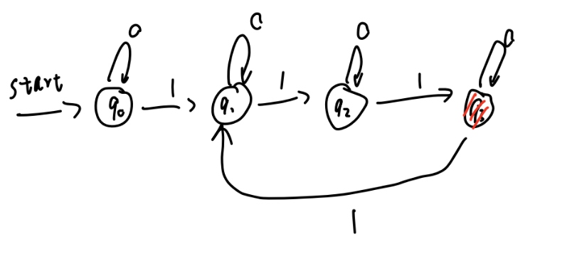
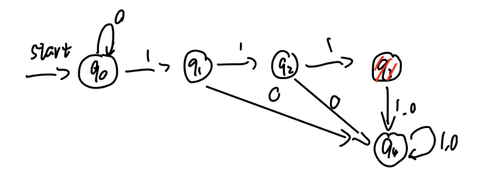

# ECE374 SP23 HW2 Question 1

## Contributors

Zhirong Chen (zhirong4)

Ziyuan Chen (ziyuanc3)

 

## Problem 1

1. Describe the DFA that describes the following languages ($\Sigma = \{0, 1\}$). Formally define the DFAs and make sure their definitions are unique w.r.t. the other languages in part (a).
    1. $L_1$ contains all strings where the substring $01$ appears an odd number of times.
    2. $L_2$ contains all strings where $\#(1, w)$ is divisible by three.
    3. $L_3$ contains all strings where the binary value of $w$ is divisible by seven.

2. Let $L$ denote the set of all strings $w \in \{0, 1\}^*$ that are in **at most two** of the languages in part (a). Formally describe a DFA with input alphabet $\Sigma = \{0, 1\}$ that accepts the
language $L$.

 

## Solution

### (a) Formal Definitions of the three DFAs

1. $M_1 = (Q_1, \Sigma, \delta_1, s_1, A_1)$, where

	$Q_1 = \{q_{10}, q_{11}, q_{12}, q_{13}\} \qquad s_1 = q_{10} \qquad A_1 = \{q_{11}, q_{12}\}$

	and $\delta_1$ is described by the table below:
	|     | $q_{10}$ | $q_{11}$ | $q_{12}$ | $q_{13}$ |
	| --- | --- | --- | --- | --- |
	| $0$ | $q_{11}$ | $q_{11}$ | $q_{13}$ | $q_{13}$ |
	| $1$ | $q_{10}$ | $q_{12}$ | $q_{12}$ | $q_{10}$ |

	

2. $M = (Q_2, \Sigma, \delta_2, s_2, A_2)$, where

	$Q_2 = \{q_{20}, q_{21}, q_{22}\} \qquad s_2 = q_{20} \qquad A_2 = \{q_{20}\}$

	and $\delta_2$ is described by the table below:
	|     | $q_{20}$ | $q_{21}$ | $q_{22}$ |
	| --- | --- | --- | --- |
	| $0$ | $q_{20}$ | $q_{21}$ | $q_{22}$ |
	| $1$ | $q_{21}$ | $q_{22}$ | $q_{20}$ |

	

3. $M = (Q_3, \Sigma, \delta_3, s_3, A_3)$, where

	$Q_3 = \{q_{30}, q_{31}, q_{32}, q_{33}, q_{34}, q_{35}, q_{36}\} \qquad s_3 = q_{30} \qquad A_3 = \{q_{30}\}$

	and $\delta_3$ is described by the table below:
	|     | $q_{30}$ | $q_{31}$ | $q_{32}$ | $q_{33}$ | $q_{34}$ | $q_{35}$ | $q_{36}$ |
	| --- | --- | --- | --- | --- | --- | --- | --- |
	| $0$ | $q_{30}$ | $q_{32}$ | $q_{34}$ | $q_{36}$ | $q_{31}$ | $q_{33}$ | $q_{35}$ |
	| $1$ | $q_{31}$ | $q_{33}$ | $q_{35}$ | $q_{30}$ | $q_{32}$ | $q_{34}$ | $q_{36}$ |

	

### (b) Putting it together

The combined DFA should be the product of the three DFAs above.

- 	$L = (Q, \Sigma, \delta, s, A)$, where

	$Q = Q_1 \times Q_2 \times Q_3 = \{(q_i, q_j, q_k) \mid q_i \in Q_1, q_j \in Q_2, q_k \in Q_3\}$

	$\delta((q_i, q_j, q_k), a) = (\delta_1(q_i, a), \delta_2(q_j, a), \delta_3(q_k, a))$

	$s = (s_1, s_2, s_3) = (q_{10}, q_{20}, q_{30})$

	$A = Q - A_1 \times A_2 \times A_3$
