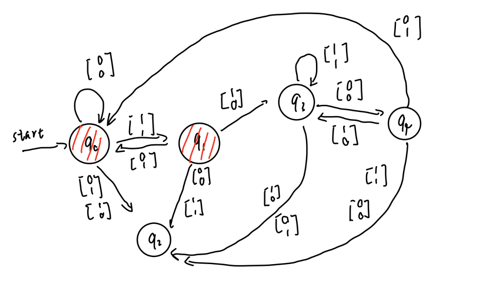

# HW2 Question 2

## Contributor
Name: Zhirong Chen

NetID: zhirong4

Name: Ziyuan Chen

NetID: ziyuanc3

## Question 

Let 

$$ \Sigma = \{\begin{bmatrix}
           0 \\
           0
         \end{bmatrix}, \begin{bmatrix}
           0 \\
           1
         \end{bmatrix}, \begin{bmatrix}
           1 \\
           0
         \end{bmatrix}, \begin{bmatrix}
           1 \\
           1
         \end{bmatrix}\} $$

Consider each row to be a binary number and let
$ C $ = { $ w \in \Sigma^* $
| the bottom row of $ w $ is three times the top row.}

For example

$$ \{\begin{bmatrix}
           0 \\
           0
         \end{bmatrix}, \begin{bmatrix}
           0 \\
           1
         \end{bmatrix}, \begin{bmatrix}
           1 \\
           1
         \end{bmatrix}, \begin{bmatrix}
           0 \\
           0
         \end{bmatrix}\} \in C $$

but 

$$ \{\begin{bmatrix}
           0 \\
           1
         \end{bmatrix}, \begin{bmatrix}
           0 \\
           1
         \end{bmatrix}, \begin{bmatrix}
           1 \\
           0
         \end{bmatrix}\} \notin C $$

Show that $ C $ is regular. (Hint, it is easier to to look at the matrices in reverse order).

## Answer
From the theorem in lecture 5, if we want to prove a language is regular, we then try to prove it can be shown as a DFA.

DFA of $ C $ can be shown as

 

where q0 and q1 are the accepted states.

Explanation of DFA:

Second row is 3 times the first row, is equivalent to second row = first row left shift by 1 + first row.

The DSA gets the characters of w from right to left as input. Each input can be viewed as an adder. The first element of input is the first addend, and the second element of the input is the adding result of the first addend and the second addend, where the second addend is the first addend of last input. To judge if the input satisfies the condition, we just need to find whether the result (second element of the input) is valid or not under the sum of first, second addends and carry out.