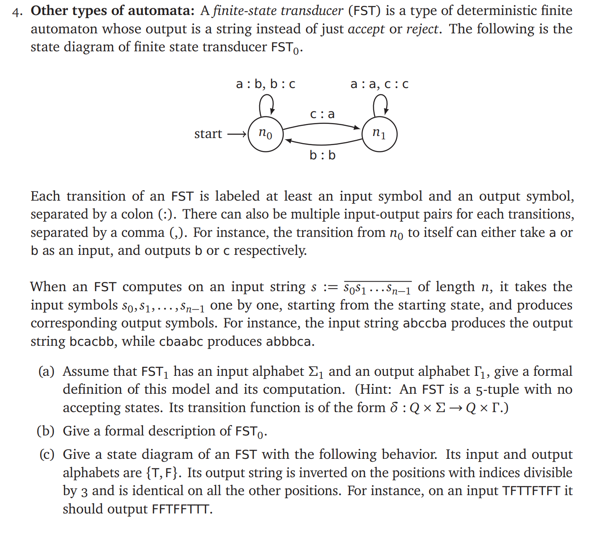
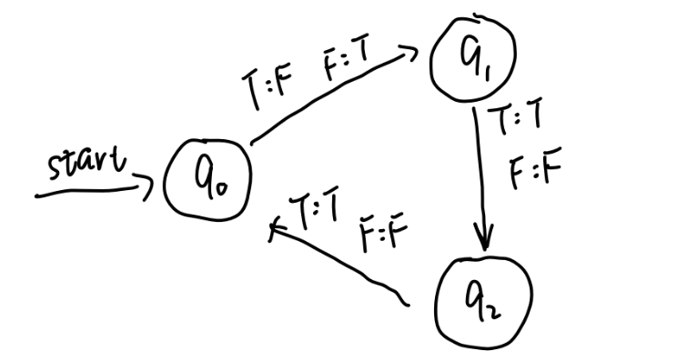

# HW2 Question 4

## Contributor
Name: Zhirong Chen

NetID: zhirong4

Name: Ziyuan Chen

NetID: ziyuanc3

## Question

## Answer
1. Formal Definition of FST1: 

    $$ M = (\Sigma_1, \Gamma_1, Q, \delta, s) $$

    where

    $ \Sigma_1 $: Input alphabet

    $ \Gamma_1 $: Output alphabet

    $ Q $: Set of states

    $ \delta $: Transition function

    $ \delta(q1, c1) = (q2, c2) $, where $ q1, q2 \in Q $ and $ c1 \in \Sigma_1, c2 \in \Gamma_1 $

    $ s $: Starting state

2. Formal Description of FST1:

    $$ M = (\Sigma_1, \Gamma_1, Q, \delta, s) $$

    where

    $ \Sigma_1 = \{a,b,c\} $

    $ \Gamma_1 = \{a,b,c\} $

    $ Q = \{n_0, n_1 \} $

    $ \delta $:

    $ \delta(n_0, a) = (n_0, b) $

    $ \delta(n_0, b) = (n_0, c) $

    $ \delta(n_0, c) = (n_1, a) $

    $ \delta(n_1, a) = (n_1, a) $

    $ \delta(n_1, b) = (n_0, b) $

    $ \delta(n_1, c) = (n_1, c) $

    $ s = n_0 $

3. Diagram is shown as below.

    
