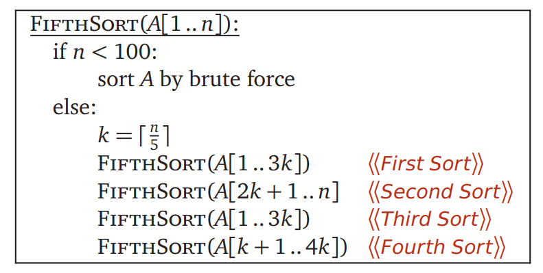

# ECE374 SP23 HW4

## Contributors

Zhirong Chen (zhirong4)

Ziyuan Chen (ziyuanc3)

<br>

## Problem 3

Below is a divide and conquer sorting algorithm called FifthSort.



**(a)** Prove that FifthSort correctly sorts its input. [Hint: Where can the smallest k
elements be?

**(b)** Would FifthSort still sort correctly if we replaced “if n < 100” with “if n < 10”?
Justify your answer.

**(c)** Would FifthSort still sort correctly if we replaced “if n < 100” with “if n < 13”?
Justify your answer.

**(d)** Would FifthSort still sort correctly if we replaced “k = ⌈n / 5⌉” with “k = ⌊n / 5⌋”? If the answer is yes, prove the correctness. If the answer is no, explain in what cases
FifthSort would fail.

**(e)** What is the running time of FifthSort? (Set up a running-time recurrence and then solve it, ignoring the floors and ceilings.) Justify your answer.


<br>

## Solution

### **(a)** 
**Proof:**

With n < 100, FifthSort(A[1..n]) is correct with brute force sorting. 

For n >= 100, we use induction. Assume FifthSort can sort A[1], A[1,2], ..., A[1..m-1], we want to prove that FifthSort can sort A[1..m], where m >= 100

As the algorithm states, m >= 100, so it enters else statements. k = ⌈m / 5⌉. 

First sort A[1..3k], we get the first 3k elements sorted.

Then sort A[2k+1..m], we get last n - 2k elemnts sorted. 

Notice that we have sorted A[2k+1..3k] before, and they are the biggest k elements in the original 1 to 3k elements. With A[2k+1..m] sorted, which means we sort the top k elements among original 1 to 3k elements, denoted as $ T_{k,1..3k} $,  and the rest of the elements (m - 3k elements), A[m-3k..m] we can get the top k elements for the whole array, denoted as $ T_{k, 1..m} $ and they are placed at the last k positions of the array. We also can get the smallest k elements among $ T_{k, 1..3k} $ and A[m-3k..m]. With the new array, we denote it as $ S_{k, 2k+1..m} $.

Then sort A'[1..3k]. Now we sort $ S_{2k, 1..3k} $, smallest 2k elements in the original first 3k elements, plus $ S_{k, 2k+1..m} $, we can get the smallest k elements sorted for the whole array, denoted as $ S_{k, 1..m} $, placed at the first k locations of the array.

Now we get smallest k elements sorted in the first k locations, biggest k elements sorted in the last k locations, then we can sort A[k+1..4k], the rest of the elements. Actually, sort A[k+1..m-k] is enough if m is not divided by 5. 
(


### **(b)** 

With n < 10, FifthSort(A[1..n]) is correct with brute force sorting.

For n > 10, FifthSort(A[1..n]) can be proved to be correct using the same induction as above.

### **(c)** 

With n < 13, FifthSort(A[1..n]) is correct with brute force sorting.

For n > 13, FifthSort(A[1..n]) can be proved to be correct using the same induction as above.

### **(d)** 

It's not correct if we replaced “k = ⌈n / 5⌉” with “k = ⌊n / 5⌋”. We change the algorithm to be "n < 10 we use brute sort" to make it convenient to give an example.

A = [5, 6, 7, 8, 9, 10, 0, 1, 2, 3, 4], 11 elements in total.

k =  ⌊n / 5⌋ = 2

FifthSort(A[1..3k]) -> A = [5, 6, 7, 8, 9, 10, 0, 1, 2, 3, 4]

FifthSort(A[2k+1..n] -> A = [5, 6, 7, 8, 0, 1, 2, 3, 4, 9, 10]

FifthSort(A[1..3k] -> A = [0, 1, 5, 6, 7, 8, 2, 3, 4, 9, 10]

FifthSort(A[k+1..4k]) -> A = [0, 1, 2, 3, 5, 6, 7, 8, 4, 9, 10], which is not sorted.

### **(e)** 

```
                    T(n)                ··· C
            /     |      |      \
        T(3n/5) T(3n/5) T(3n/5) T(3n/5) ··· C
            ·     ·      ·         ·
            ·     ·      ·         · 
            ·     ·      ·         ·
```

T(n) = 4 * T(3n/5) + C

= T(m) * (4 * 4 * ... * 4) where m < 100 and there are log(n) times multiplication

T(n) = 4^(log(n))
